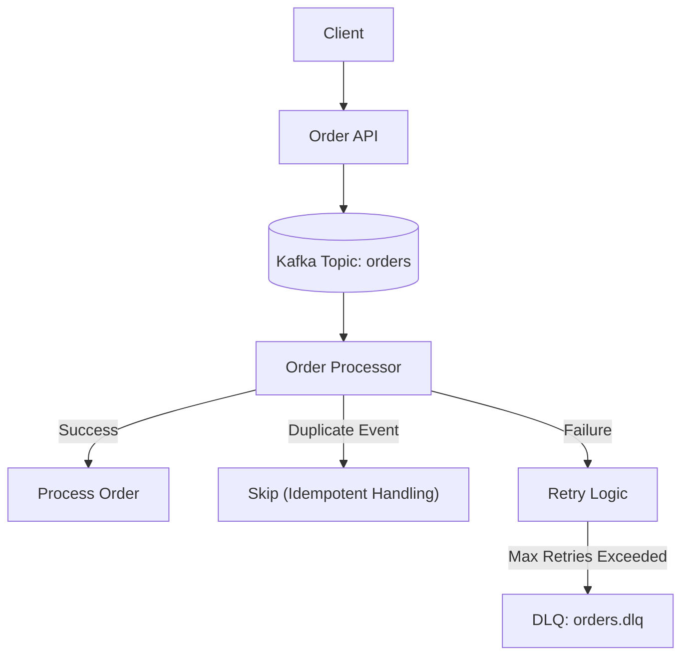

# Event-Driven Order Processing System

A production-style event-driven microservices system demonstrating reliable, scalable order processing using Kafka.

This project focuses on **resiliency, fault tolerance, and real-world distributed system patterns**, including idempotent processing, retry strategies, and dead-letter queue (DLQ) handling.

---

## 🚀 Overview

This system simulates an order processing pipeline:

1. Order API receives incoming requests
2. Events are published to Kafka
3. Order Processor consumes and processes events
4. Failures are retried and eventually routed to a DLQ

The design emphasizes **reliability under failure conditions**, not just happy-path processing.

---

## 🏗️ Architecture



---

## ⚙️ Tech Stack

- Python (Flask)
- Apache Kafka
- Docker / Docker Compose
- REST APIs
- Structured Logging (in progress)

---

## ✅ Implemented Capabilities

### Event-Driven Processing
- Decoupled producer/consumer architecture using Kafka
- Asynchronous processing of order events

### Idempotent Event Handling
- Duplicate event detection using event IDs
- Safe reprocessing without data corruption

### Retry Strategy
- Configurable retry logic for transient failures
- Exponential backoff approach (context-aware)

### Dead Letter Queue (DLQ)
- Failed events routed to a dedicated DLQ topic
- Failure context preserved for debugging and reprocessing

### Structured Error Handling
- Clear exception flow from consumer → service layer
- Original exceptions preserved and included in DLQ messages

### Config-Driven Behavior
- Retry limits and system behavior controlled via configuration (TOML)
- Separation of logic from runtime configuration

---

## 📊 Failure Handling Flow

| Scenario              | Behavior                                      |
|----------------------|-----------------------------------------------|
| Successful processing | Event processed normally                     |
| Duplicate event       | Skipped with warning (no failure)            |
| Transient failure     | Retried with backoff                         |
| Persistent failure    | Sent to DLQ with error details               |

---

## 🧠 Design Highlights

This project demonstrates several production-grade design decisions:

- Separation of concerns between consumer, validation, and service layers
- Idempotent processing to ensure safe retries
- Centralized retry logic with controlled failure handling
- DLQ strategy for failure isolation and observability
- Config-driven architecture for flexibility and maintainability

---

## 🔍 Example Use Cases

- High-throughput order processing systems
- Event-driven microservices architectures
- Reliable message processing pipelines
- Systems requiring failure recovery and auditability

---

## 📌 Design Tradeoffs

- Chose idempotent consumer pattern over exactly-once semantics to simplify system guarantees
- Implemented DLQ instead of blocking retries to isolate failures and maintain throughput
- Used config-driven retry behavior to allow flexible tuning without redeployment

---

## ▶️ Running the System

```bash
docker-compose up --build
```

---

## 🧪 Testing the API

You can test the API using the provided `.http` file or by sending a request:

```http
POST /orders
Content-Type: application/json

{
  "order_id": "12345",
  "event_id": "abc-123"
}
```

---

## 🔮 Future Enhancements

- Full structured logging (JSON logs for observability platforms like Splunk)
- Metrics and monitoring integration (Prometheus/Grafana)
- DLQ replay tooling
- Multi-partition Kafka scaling
- Integration with cloud-managed Kafka (AWS MSK / Confluent)

---

## 💡 Key Takeaways

This project is not just a Kafka demo — it focuses on:

- Designing for failure, not just success
- Building resilient, production-ready event-driven systems
- Applying real-world backend architecture patterns used in modern distributed systems  